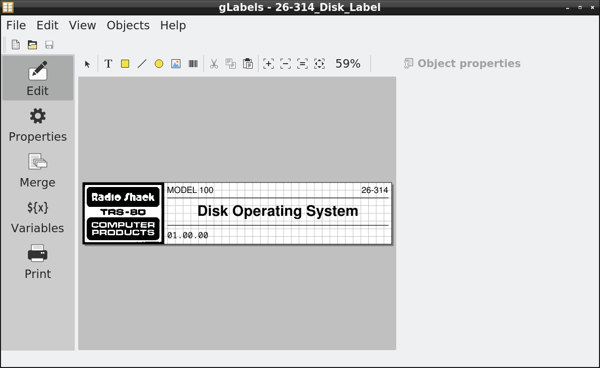
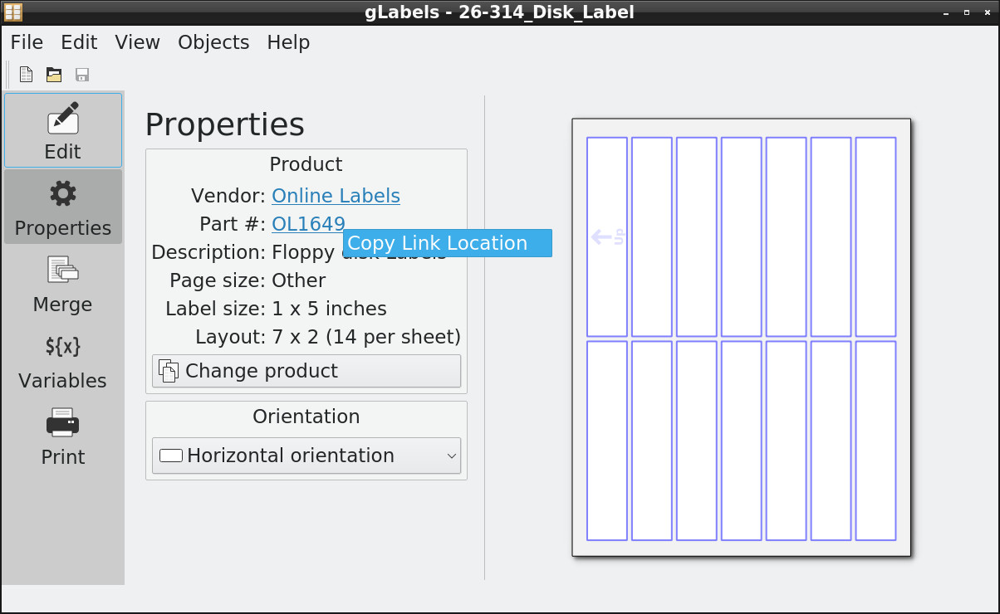
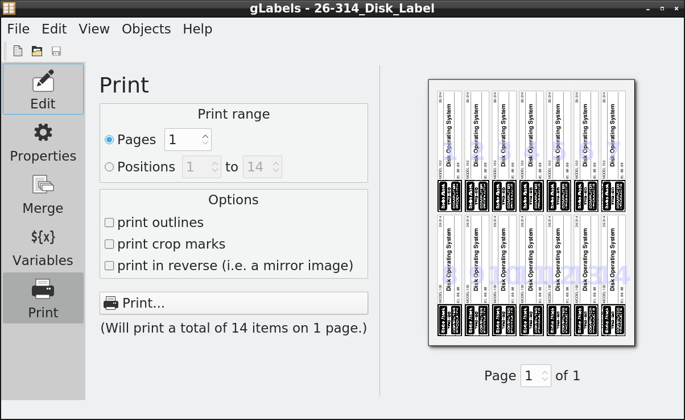
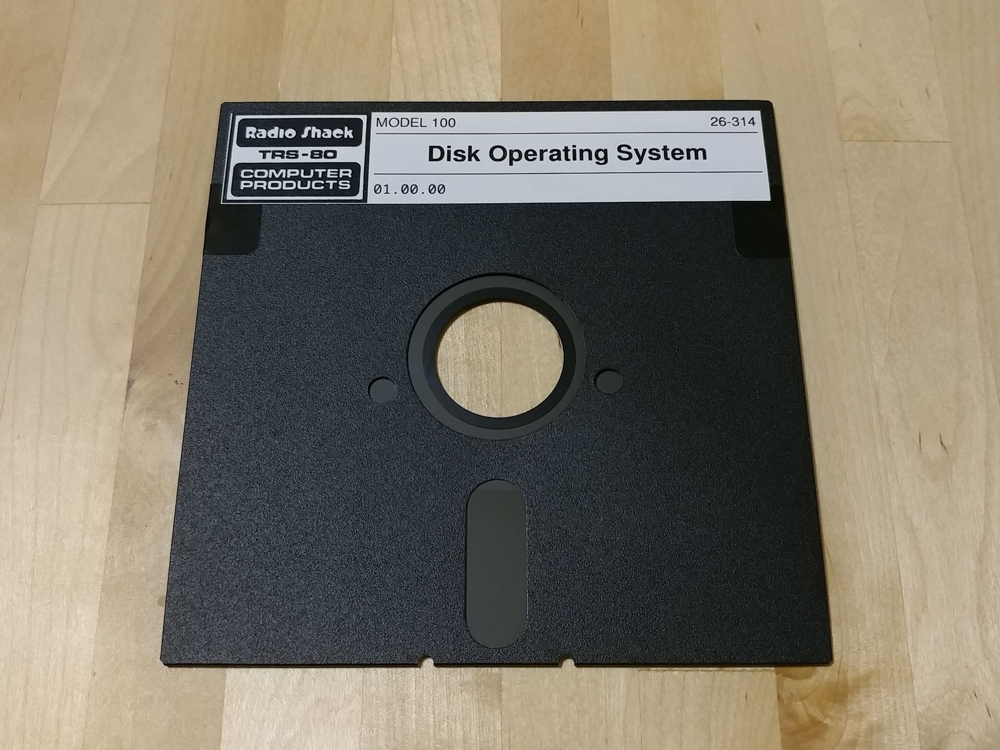

# Disk Labels  
Labels for copies of vintage floppy disk images.

These labels use [glabels](https://github.com/jimevins/glabels-qt).

Each \*.glabels source file includes a link to the matching blank label stock, which is displayed in the Properties tab within the app.

Printing hints for good results:

Set the print quality options to greyscale and normal/high quality (not draft).

Snug the guides in the paper tray right up to the paper so the guides touch the paper on both left & right so the stock is perfectly straight and perfectly centered.

Set the paper type to heavy bond or gloss or card, 150 gram or more. Different printers and different printer drivers have different ways of saying this, but basically you need to tell the printer that the paper is thick and/or dense.  
Example, HP Color LaserJet MFP M281fdw: Front panel: Home -> Setup -> System Setup -> Paper Setup -> Default Paper Type -> Card Glossy 176-220g  
This makes printer run the fuser hotter and slower, which is necessary for the toner to melt fully and bond to the paper fully.  
Remember to restore that setting back to plain paper afterwards. On Windows you may be able to do this in the print job properties instead of the printer's front panel.  

If you're not using a laser printer, then don't use the actual label stock linked in the \*.glables files. Find the inkjet version with the same dimensions.

A good write-protect sticker for 5 1/4" floppies is [ChromaLabel 1" x 3/4" in black](https://www.chromalabel.com/products/1-3-4-inch-color-code-squares)

  
  
  
  
